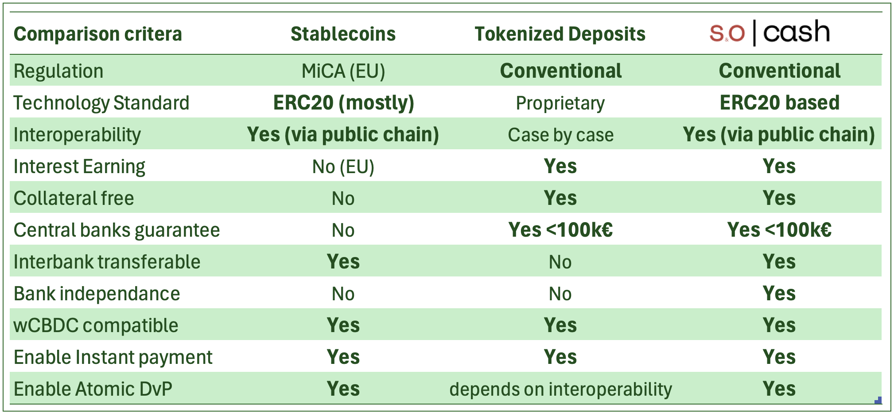
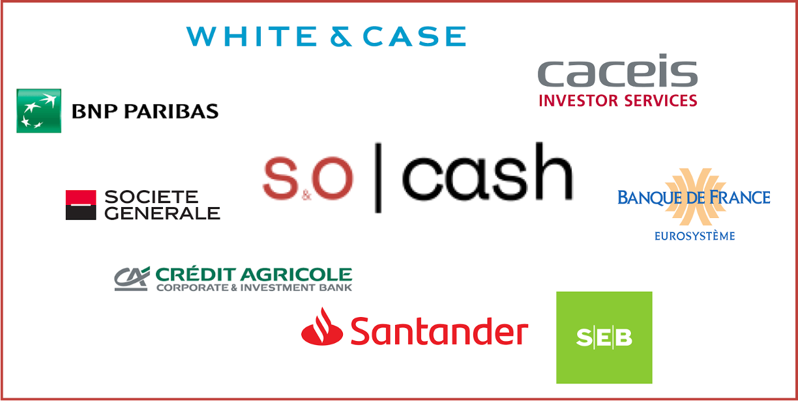
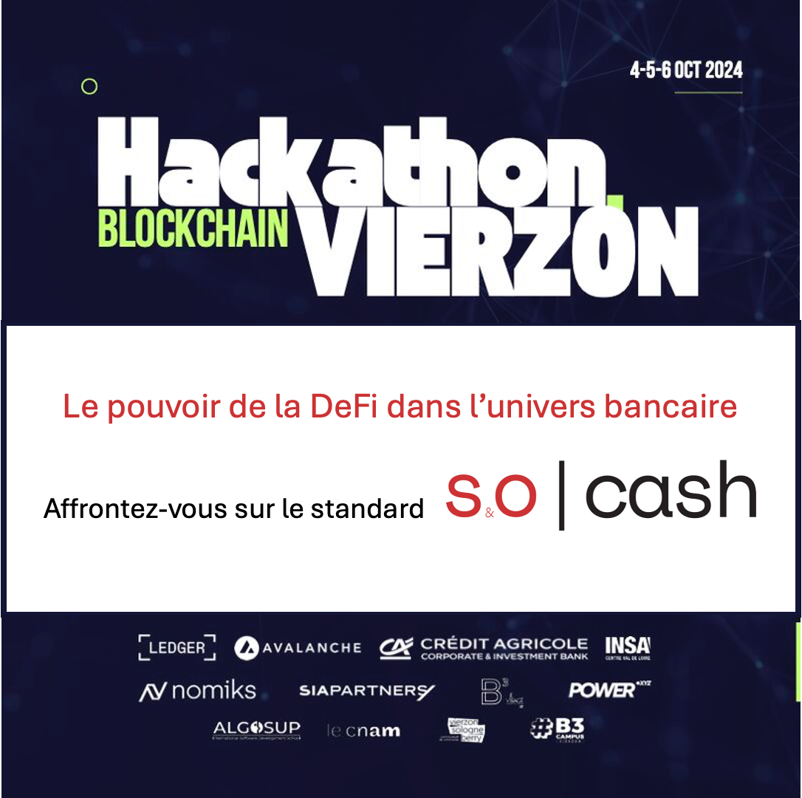

# Articles LinkedIn to explain so|cash

Add a disclaimer: 
This post does not necessary reflect my employer's opinion.

## What is so|cash ?
♻️ Sustainable & Open Cash Framework (so|cash) is an EVM open source ⛓️ blockchain protocol that enables the banking industry to operate deposit accounts in a generic shared IT infrastructure. Like a DeFi protocol all users can use and benefit from the model if they respect the rules (the standard) 📢.  
But unlike a DeFi protocol, so|cash is built to respect the laws 👩🏽‍⚖️ and regulations of the banking industry.

🏦 Concretely, a bank, licensed to offer deposit accounts, deploys a smart contract in a EVM compatible blockchain that acts as a back-office program in which accounts can be created, maintained and payments operated.

💸 Because of the nature of the underlying blockchain infrastructure, the account holders can autonomously and instantly access  their accounts and make payments. Such cash transfers are consequently reaching their beneficiary at exactly the same instant as it is leaving the account (real instant payment).

👨🏻‍💻 With such a program, respecting a set of standard interfaces, banks can make their back-office systems talk to each other without relying on asynchronous messages transported by third party providers. In particular a payment can occur between accounts in two different banks within a single program operation, making the transfer fully atomic (both debit and credit succeed or none happen) and instantaneous (both debit and credit have the same timestamp).

⛓️ Because the underlying blockchain infrastructure is a shared ledger (also referred as "unified ledger") between various asset classes and businesses, such a payment solution is easily programmable, leveraging the benefits of executing a payment when conditions are met or triggering a delivery when a payment is effective.

📢 Stay tuned for more #socash posts.

## How so|cash payment work ?
♻️ Sustainable & Open Cash Framework (so|cash) is an EVM open source blockchain protocol enabling banks to open deposit accounts for their clients. Let's see how it works:

🏦 Each bank, participating in the protocol, deploys their own smart contract, independently (via a provider or not), that will act as a back office for the bank's deposit accounts. Each bank records their relationships with other banks so smart contracts of each bank can interact with each other (equivalent to a RMA key exchange).   

⛓️ A so|cash compatible smart contract exposes a few interfaces (for the client, for other banks, for the back office teams and internal systems). Technical documentation is provided at https://github.com/so-cash.

💸 Let's consider two payment scenarios: 💸

✅ When a client wants to pay, from its account, a beneficiary in the same bank, the client (or a program acting for the client) will call the 'transfer' function on its account and the back office smart contract will identify the beneficiary account (IBAN or EVM address), ensure it exists, that credits are allowed (possibly including AML/CTF), ensure that the source account has enough funds; and then, in a single operation, debit the amount from the account and credit it to the beneficiary account. This generates a unique payment identifier (reported in an EVM log).

✅ If the beneficiary's account is in a different bank, and if this bank has a vostro account with the paying bank, then the bank smart contract performs (all in a single operation) the controls, the transfer of the amount from the client's account to the vostro of the beneficiary's bank, calls the smart contract of the beneficiary's bank to instruct a credit to the beneficiary. Inside the same operation, the beneficiary's bank checks that its nostro (i.e. the vostro) has been credited, performs controls on the payment and credit the beneficiary's account.   
At the end of this atomic blockchain operation, the beneficiary's bank has an increased balance in its nostro account at the paying bank. This balance bears a credit risk and prudence (and treasury practices) recommends that it is converted into a central bank balance (assuming the bank has access to central bank money in that currency).

🏦 Therefore, the beneficiary's bank will initiate a transfer from its nostro to its reserve account and this is where so|cash model integrates with a wholesale Central Bank Digital Currency (and any other interbank settlement solution) using DeFi-like bridges involving time locking scheme (HTLC 🔐).

📢 Stay tuned for more #socash posts.

## How so|cash compare to stablecoins and tokenized deposits ?
♻️ Sustainable & Open Cash Framework (so|cash) is an EVM open source blockchain protocol that has the benefits of both stablecoins 🪙 and tokenized deposits 💳, the usual private sector alternatives for privately issued money.

💡 Inspired initially by both alternatives, so|cash keeps the best of both worlds:

🪙 Stablecoins inherit from DeFi their technical standard (mostly ERC20 compatible tokens) and provide a great interoperability solution in blockchain ecosystems. They however rely on different regulation than commercial bank money and (in MiCA) prevent holders to earn interests on their balance. Additionally, the issuer of the stable coin is unique (or a formal cooperation) and must keep an equivalent amount of collateral that cannot be part of the bank liquidity for financing the economy.

💳 Tokenized deposits inherit from the banking industry their regulation and provide a great solution for banks to operate their deposit accounts in a shared IT infrastructure. They however cannot be transferred directly to another bank as they embed a relationship between the bank and the account holder. Additionally, most of the tokenized deposits are currently in private chains and rely on a single operator (either for a bank or a consortium of banks). Participants banks are therefore relying on a mandatory single provider, loosing their independance.

✅ As the table below shows, so|cash provides the benefits of any digital form of private money (instant payment, atomic DvP, CBDC compatible) without the limitations of stablecoins and tokenized deposits. To leverage those benefits, banks should adopt so|cash as a common standard and choose a compatible provider (or do it themselve).

📢 Stay tuned for more #socash posts.

## ECB wCBDC ongoing experimentations with so|cash
Crédit Agricole CIB and CACEIS are experimenting the use of EUR wCBDC in conjunction with the so|cash protocol with the legal support of White&Case. 

The objectives of the tests are to demonstrate the interoperability model of wCBDC, using Banque de France solution, DL3S, with a decentralized correspondent banking protocol, so|cash, and assess the feasibility and merit of a unified ledger of commercial bank money for the banking industry.

The tests are conducted in a sandbox environment with fictive clients, accounts and balances. The setup puts in situation 3 banks, CACIB and CACEIS with wCBDC wallets at Banque de France and a generic European bank with a wCBDC wallet at a fictive local central bank. Each bank has deployed a dedicated so|cash compatible back office module and established a correspondent banking relationship with the other banks.

The construction of the tests and the technology has enabled the participants to deepen the understanding of the mechanism and requirements of a decentralized, tokenized, instant, atomic correspondent banking model and the impacts on clients, banks and central banks existing infrastructure and organisation.
Crédit Agricole group invited European banks to contribute to the tests with their feedback on dedicated observation sessions and their inputs are very valuable to complete the picture and reach consensus on the model : Société Générale, BNPP, Santander, SEB. Thanks you for this.

A detailed publication will be made when the experiments are completed to expose the learning and the way so|cash operates in a multi-banks environment, in conjuction with a wCBDC interoperability model.

However, to date, we can share that the technology enable a cooperative interbank protocol, where each bank remains fully autonomous from any dedicated provider, maintain competition, while upgrading their payments infrastructure and offer instant cash management services to their client and themselves. In addition, this approach appears to respond well to instantaneity of the financial flows (payment and delivery) that, progressively, will puts pressure on corporates and banks treasury departments.

📢 Stay tuned for more #socash posts.

Post to be validated by all banks communication before release.

## 🚀 Hackathon Blockchain Vierzon 2024 
♻️ Sustainable & Open Cash Framework (so|cash) is an EVM open source blockchain protocol. 
It will be put to the test with nearly a hundred candidates who will compete for the best business case during the [Hackathon Blockchain Vierzon 2024](https://lnkd.in/eZeFDi5F) 🚀.

⛓️ so|cash is the conjuction of the world of DeFi by its technology (pure blockchain, decentralized) while aligned with the banking rules of business 🏦.

💡 The scope of the cases will be revealed very soon.

---- 

♻️ Sustainable & Open Cash Framework (so|cash) est un protocole blockchain open source basé sur EVM. 
Il sera mis à l'épreuve avec une centaine de candidats qui concourront pour le meilleur cas d'utilisation lors du [Hackathon Blockchain Vierzon 2024](https://lnkd.in/eZeFDi5F) 🚀.

⛓️ so|cash est la conjonction du monde de la DeFi par sa technologie (pure blockchain, décentralisée) tout en étant aligné avec les règles du jeu bancaires 🏦.

💡 Les cas d'utilisation seront révélés très prochainement.

---- 

📢 Stay tuned for more #socash posts.
📚 Discover so|cash at https://github.com/so-cash 

## Atomic operation between asset classes thanks to the blockchain

## Instant operation in the blockchain

## Finternet, the future of finance

## Create a network effect in Finance via open sourcing

## Instant payment with so|cash

## Trade Finance with so|cash

## Correspondent banking with so|cash
