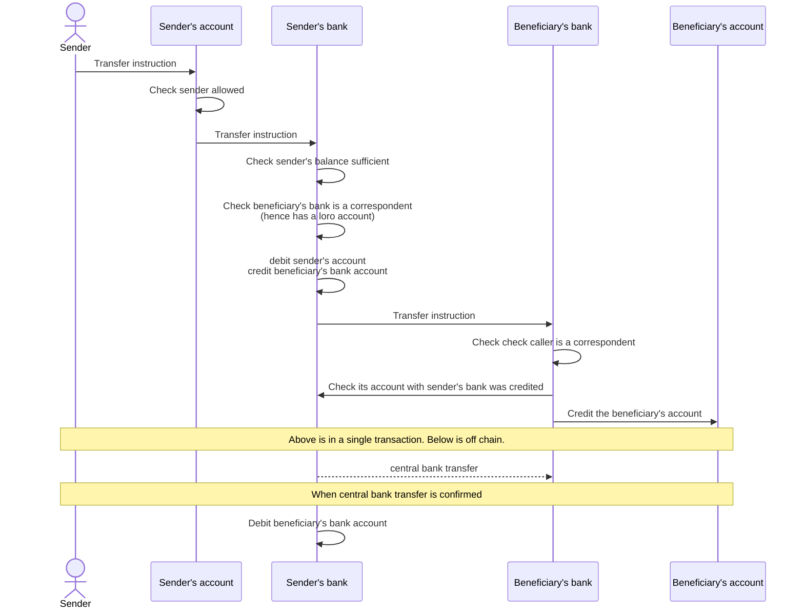
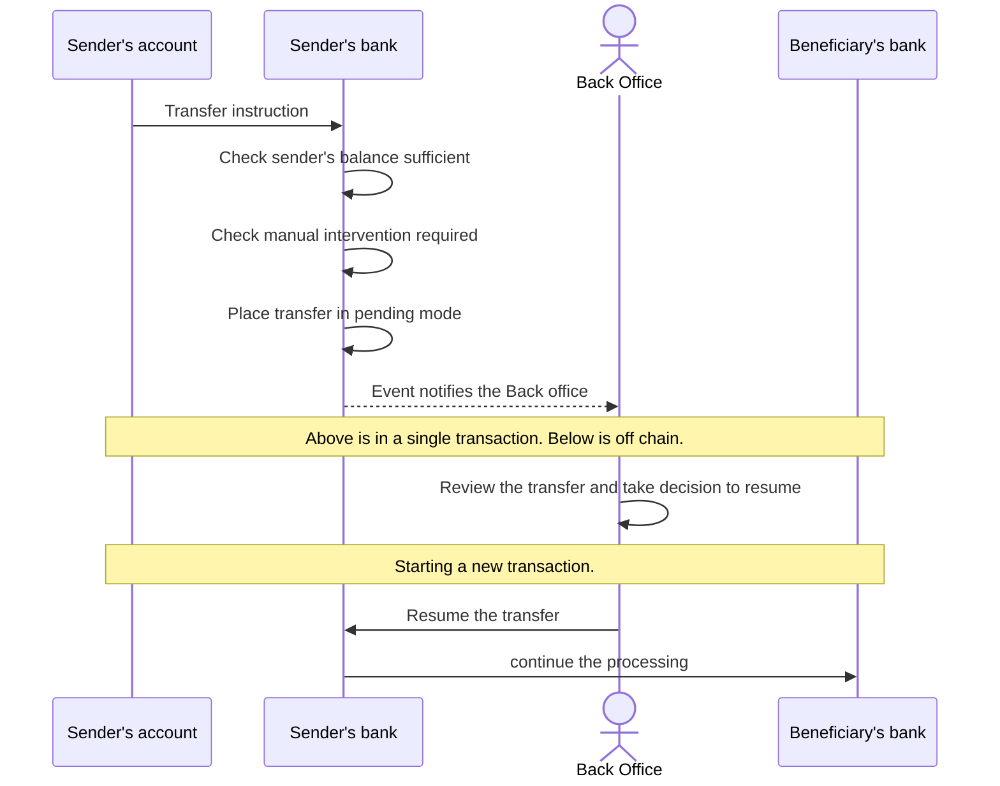
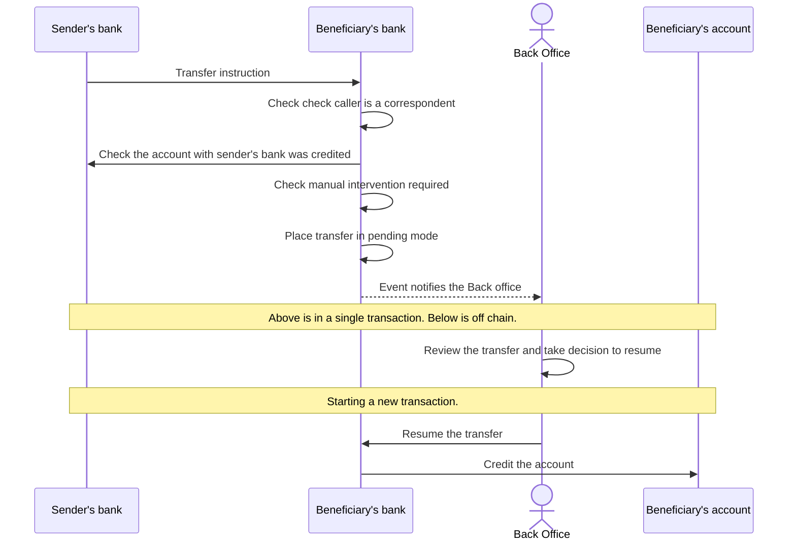
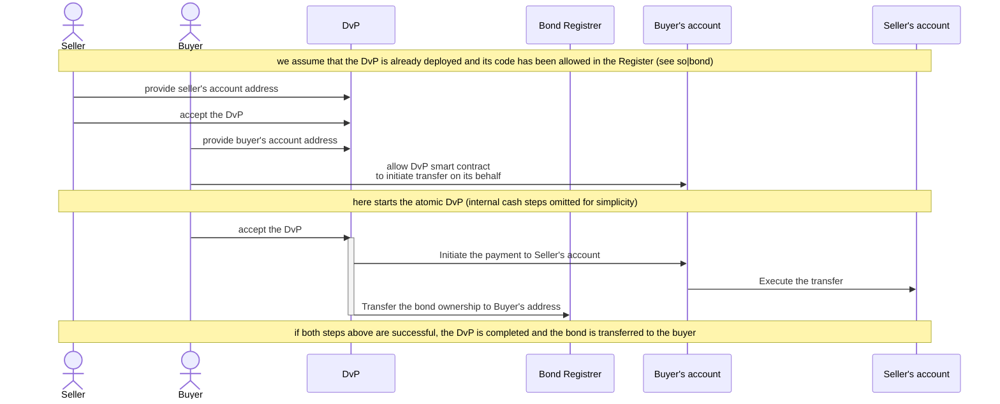

Preamble: The so|cash, sustainable & open cash framework, is open sourced under Apache 2.0 licence and provided as a guidance to ellaborate with other financial institutions an on-chain correspondent banking model. The framework is based on the experimentation and lessons learned during the European Central Bank's 2024 EUR wCBDC experiments. 

This page is intended to be a living document and will be updated as the so|cash experience evolves. The framework is provided as is and without any warranty. The framework is not an advise for investment or any other financial decision. 

# Sustainable & Open Cash framework

The documentation of the so|cash model is available at https://github.com/so-cash/.github/wiki. 

The source code is now published in the repository [so-cash contracts](https://github.com/so-cash/contracts).

## 1. Introduction and Background

With the development of asset tokenisation in blockchain, many have realised that the gain will come from the atomic settlement of an exchange of such tokenized asset against an asset that will be an acceptable representation of the value of such asset and making the exchange final such that there is no (or limited) risk that the exchange will be reversed.

Among the solutions that have been proposed and tested we can cite the use of stable coins, the tokenization of client deposits, the use of central bank digital currencies (CBDC), the use of a central bank as a trusted third party to settle the exchange and side dedicated networks to settle the exchange (such as the Fnality project of the RLN project).

All these solutions have benefits and drawbacks. 

The use of stable coins is limited by the fact that the value of the stable coin, assuming properly managed, is guaranteed by a private structure, embedding in it a credit risk, and making it non fungible with other stable coins from another entity and, in Europe, not elligible to interests earning (MiCA). Further more, the stable coin model assume that the issuer of such token will not use the collateral to invest in other assets, draining liquidity from the banks to play their role in financing the economy. 

The use of tokenized deposits, as a on-chain representation of a cash deposit from a client, is limited by the fact that transferring the ownership of such a token implies making the beneficiary a "de-facto" client of of bank where the deposit was stored. Indeed a deposit in a bank is a liability of the bank to the client. Therefore the bank will have to perform the AML/KYC checks on the beneficiary and the beneficiary will have to accept the terms and conditions of the bank. This is not a problem when the beneficiary is a client of the bank but it is when the beneficiary is not a client of the bank. Further more, the bank will have to manage the liquidity of the deposit and the risk of the deposit.

The use of CBDC is limited by the fact that the CBDC is not available (yet - work in progress in many countries) and that if and when available it is likely not going to be available to non financial institutions (for wholesale CBDC) or in limited quantity (retail CBDC). Further more, we do not anticipate that central banks will be happy to see the country money being issued in an infrastructure that they do not fully control (hence if issued, it will be in a dedicated network). Therefore this will create the need for bridges between the networks where tokenised assets circulate and the CBDC network and removing the benefit of an atomic settlement.

Similarly, network of settlement such as Fnality or RLN will require the creation of bridges between the network and the asset networks, removing the benefit of an atomic settlement and draining liquidity from the commercial banks.


The `so|cash` framework is an alternative proposal that is designed to address the above issues by using a network of commercial banks to settle the exchange of tokenised assets. The framework is based on the following principles:
- the blockchain network is to be seen as an agnostic IT infrastructure shared between all parties,
- cash on-chain is not removing liquidity from the commercial banks,
- no central actor should be in control of the settlement network,
- the settlement network should be open to any financial institution and client,
- the existing regulatory and legal framework for correspondent banking should be used

`so|cash` is a brand name for solutions that have been presented as tokenised deposits, on-chain cash accounts, tokenized correspondent banking or similar appelations.

## 2. The existing correspondent banking model

In today's world, a (physical or moral) person holds a cash account with a commercial bank in a certain fiat currency to host the money it owns in this currency. Of course it can have several bank account in several banks and in several currencies.

Commercial banks will record in their balance sheet (i.e. in their accounting books) a liability to that person that says that the banks owes such amount of money to that person. This money is either received by the bank from another bank on behalf of that person or it was created by the bank itself as a loan to the person. In both cases, the bank will record an asset (against the liability) in its books with the received money (held by the bank in another bank, generally a central bank) or with the loan granted.

Commercial banks will consider the deposited cash as its own (when not comming from a loan) and take actions to make that money useful to the economy by lending it or investing it. The duties of the banks is to ensure that the money is available to the person when needed and to do this the bank perform an ALM (Assets and Liabilities Management) to ensure that the bank has enough liquidity at any point in time to meet its obligations and that regulatory ratios are respected (liquidity and risk ratios defined - in compliant member states - by the Basel Committee on Banking Supervision (BCBS)).

The money that the person has in its account is a legal fiat money, acceptable for any payment, because the account that holds it is with an instititution regulated and supervised. 

When the person holding the account (the sender) wishes to transfer its own money to the account of another person (the beneficiary of the transfer) it provides such transfer instruction to its bank (typically a Swift MT101). Several scenarios are possible:
- the beneficiary's account is in the same bank : the bank will simply modify the ownership of the money (ie, the counterparty of its liability) in its books by debitting the sender's account and crediting the beneficiary's account.
- the beneficiary's account is not in the same bank (bank B), and the sender's bank has a correspondent banking relationship with bank B : the sender's bank will send a payment instruction to bank B (typically a Swift MT103) to instruct bank B to credit the beneficiary's account. The sender's bank will debit the sender's account and will perform an interbank payment, generally in central bank systems. Bank B, upon reception of the payment, will credit the beneficiary's account in its books.
- the beneficiary's account is with a bank (bank C) that is not a correspondent of the sender's bank: the sender's bank should identify a correspondent bank (bank D) that can route the payment to bank C and then instruct bank D to act as intermediary of the payment and relay the money.
- the beneficiary's account is in a different currency: a currency exchange will be needed and multiple scenarios can arise depending on who performs the purchase of the original currency and the sale of the target currency. 

When the person holding the account accepts that a third party transfer money out of its account it must first inform its bank that there is a form of delegation to instruct the bank to perform transfer on its behalf. Then the third party can perform such operation. This is the case for direct debits where the beneficiary has the right to initiate a transfer. There are other cases where intermediaries can initiate the transfer on behalf of the sender, such as the case of a merchant that accepts payment by card and the card company instructs the sender's bank to initiate the transfer (if not a credit card). In these cases, the transfer instruction can be processed in the same way as above following different scenarios.

One particular element to understand is that interbanks transfers (when both banks have an account with the clearing system in central bank money) is done with the money they held at the central bank (ie the central bank having a liability to them). When they have to make such transfer but they do not have the necessary amount in their central bank account, the bank will call the market (ie other banks) to borrow the money or rely on their correspondent liquidity services. This is the Treasury service of a bank.

## 3. The `so|cash` framework 

The `so|cash` framework uses the blockchain as an IT infrastructure to replicate the correspondent banking model.

Each bank participating will host a back office module per currency in the form of a smart contract. Such module manages the volume of cash that are the liabilities to its customers.   
Each account holder will be granted an account represented on-chain and created by the bank in the form of a dedicated smart contract linked to the back office module. This account will represent the interface for the account holder to see its balance, initiate transfers or delegate its rights to make transfer.

When a transfer is initiated by a customer, on its smart contract account, to a beneficiary, the instruction is transfered to the back office module where the different transfer rules are implemented. If the beneficiary account is managed in the same back office module, then it can be implemented as local transfer (like a stable coin transfer logic). However if the transfer involves a beneficiary that is in another bank, the on-chain back office module should be in capacity to reach the smart contract of the beneficiary's bank via a smart contract call.

Therefore some convention need to be agreed between the banks to enable the back office modules to communicate in a similar way as the existing swift messages today reflect the conventions used. 

A high level representation of an account smart contract and a bank back office module is:

```https://asciiflow.com
            ┌┬─────────────────────┬┐                
            ││ ISoCashOwnedAccount ││                
            │├─────────────────────┤│                
  Client───►││     IHTLCPayment    ││     Off-chain  
            │├─────────────────────┤│    third party 
            ││    IERC20Metadata   ││      program   
            └┴─────────┬───────────┴┘        │       
                       │                     │       
                       │                     │       
                       │                     │       
                 ┌┬────▼─────────────────────▼────┬┐ 
                 ││       ISoCashBankExternal     ││ 
                 │├──────────┬────────────────────┤│ 
                 ││          │                    ││ 
┌─────────────┐  ││          │                    ││ 
│             │  ││          │      state &       ││ 
│ Other bank  ├──┼► ISoCash- │                    ││ 
│    smart    │  ││ InterBank│                    ││ 
│   contract  │  ││          │    implementation  ││ 
└─────────────┘  ││          │                    ││ 
                 ││          │                    ││ 
                 │├──────────┴────────────────────┤│ 
                 ││     ISoCashBankBackOffice     ││ 
                 └┴───────────────▲───────────────┴┘ 
                                  │                  
                                  │                  
                                Off-chain            
                              Bank program           
                                                           
```

### 3.1. Interbank instruction between smart contracts

First let's consider the simple flow diagram below illustrating a transfer initiated by an account holder to a beneficiary in a different bank where the two banks have a correspondent relationship.



In this diagram we see that for the beneficiary's bank to accept the transfer and credit its client (the beneficiary) it has to receive from the sender's bank a confirmation that it has put money on its account. For a bank, it is a commitment that it takes a liability toward the beneficiary's bank. 

Repayment of such liability can be done in many ways depending on the agreements between the banks. They can both agree to be paid on the net due to each other at the end of day by conventional means, or to be paid immediatly by a central bank transfer, or to be paid by a central bank transfer when the debt reaches a certain amount (etc). The action of repaying the debt can be initiated by a third party who would be entitled by the sender's bank to debit its account at the central bank and entitled by the receiving bank to clear the debt.

When paid, depending on how the payment is confirmed to be completed, someone must debit the liability of the sender's bank toward the beneficiary's bank. There are multiple approach to do this and so|cash does not impose a specific one but must provides the tools to interface with external solution.

So for smart contracts to be able to communicate between them, they must agree on a standard api to call on one side and to implement on the other side. The following is the current proposal for the interbank communication.

The endpoints that appears useful are (see `ISoCashInterBank` interface in the code):
* instructing a transfer between banks `interbankTransfer`, that provides the information of the beneficiary the amount to be transfered and any additional information that may be necessary. Remermber that the smart contracts of the banks manage one currency at a time.
* advising that the account of a bank has been credited or debited, so the other bank can update its nostro balance (necessary for the interbank transfer) `advice(amount, direction)`
* request a bilateral netting of the nostro balance `interbankNetting(amount)` so banks can agree to reduce each other' liabilities.

### 3.2 User to bank convention to a standard API

Users of a bank account managed on-chain will need to interact with the bank back office module to initiate transfers. This should be done through an intermediary smart contract dedicated to the representation of that account and integrating the specific controls that the bank and the client want to implement. This intermediary smart contract will be the interface between the account holder and the bank back office module.

In order to make the bank account as much as possible compatible with the industry standard the interface shall respect the `IERC20` interface convention. This will also enable the user to use any wallet that is ERC20 compatible to interact with its account.

The following gives an idea of the interface of the user bank account. If you want to see the full interface, please refer to the code.

```javascript
interface ISoCashOwnedAccount is IERC20Metadata {
  // Get the bank that manages the account
  function bank() external view returns (ISoCashBank);

  // functions to get identification of the account
  function name() external view returns(string memory);
  function iban() external view returns(string memory);
  function accountNumber() external view returns(AccountNumber);

  // an account can have a balance reserved for a certain purpose
  function lockedBalance() external view returns(uint256);
  // the unlocked balance can be used for transfer without condition
  function unlockedBalance() external view returns(uint256);
  // the full balance can be negative if the account is in overdraft
  function fullBalance() external view returns(int256);

  // make a transfer as an owner of the account or when allowed by the owner using ERC20 allowance
  function transferEx(RecipentInfo calldata recipient, uint256 amount, string calldata details) external returns (bool);

  // functions to lock, unlock and use locked funds
  function lockFunds(RecipentInfo calldata recipient, uint256 amount, 
              uint256 deadline, bytes32 hashlockPaid, bytes32 hashlockCancel, 
              string calldata opaque) external returns (bytes32 key);
  function unlockFunds(bytes32 key, string calldata secret) external returns (bool);
  function transferLockedFunds(bytes32 key, RecipentInfo calldata recipient, string calldata secret, string calldata details) external returns (bool);
}

```

### 3.3. The interfacing between bank back office module and the internal systems

When the bank starts creating bank account on-chain, it does not mean that the bank will stop using its internal systems. The bank will still need to manage the liquidity of the bank accounts, the risk of the bank, the regulatory reporting, the accounting, etc.

Therefore the bank back office module will need to interface the internal systems of the bank with the modules deployed on chain. This can be done in different ways depending on the internal systems of the bank. We can consider the following events that need to be managed:

### 3.3.1 Receiving a credit instruction from the conventional system

When a credit instruction is received from an external bank (or following the disbursment of a loan) to an on-chain bank account, the on-chain bank back office module will need to be instructed to credit the account by the legacy system.
```javascript
// called by a bank wallet controlling the on-chain module
bo.credit(accountAddress, amount);
```
This will add new amount to the address of the account in the bank back office module (similar to a ERC20 mint). 
Subsequently, the bank will apply accounting entries to reflect the credit in its books (for instance, credit the account/debit the nostro of the bank where the money was received).

### 3.3.2 Receiving a transfer instruction to an off-chain account

When a transfer instruction is received on an on-chain account to credit an account that is off-chain, the bank should accept the credit and take the cash out of the blockchain to credit the account in its legacy system.
```javascript
// called by a bank wallet controlling the on-chain module
bo.debit(accountAddress, amount);
```
This will remove the amount from the address of the account in the bank back office module (similar to an ERC20 burn). 
Subsequently, the bank will apply accounting entries to reflect the debit in its books (for instance, debit the account/credit the nostro of the bank).

### 3.3.3 Processing accounting of on-chain transfers

When a transfer is executed on-chain, the bank back office module will need to inform the legacy system of the bank to apply the accounting entries.

On-chain, the transfer will be materialized by `Transfer(address from, address to, uint256 value)` event generated by the Bank module (same as for an ERC20) that the legacy system wil capture. The legacy system will check whether the `from` and `to` addresses represents account managed by the bank. If so it can decide the accounting entries to apply.

`from` or `to` addresses can be the zero address in the `Transfer` event when a debit/credit has been made on the account. 

The below table summarize the accounting entries to apply depending on whether the `from` and `to` addresses are account of this bank or another bank.

| from |  to  | debit a/c | credit a/c | Comment |
|------|------|-----------|------------|---------|
|  account  |  account  |  from  |  to  | move liabilities locally  |
|  zero  | account |  nostro  |  to | credit client a/c against the nostro that is expected to be credited |
|  account  | zero |  from  |  nostro | debit client a/c against the nostro |

### 3.3.4 Performing AML/KYC checks

When a transfer is initiated on-chain, the bank back office module will need to perform the AML/KYC checks on the sender and the beneficiary. 

This part is tricky because the bank back office module will not have access to the identity of the sender and the beneficiary. The bank back office module will only have access to the address and IBAN of the sender and the beneficiary.

In a conventional payment processing the bank will process the payment instruction and filter them against a list of sanctioned entities using solution like the Fircosoft based on the textual information of the payment instruction. 

In a blockchain based solution, the beneficiary identity is represented as an address. Therefore the bank back office module will need to have access to a list of sanctioned addresses. This list can be provided by a third party or the bank can maintain its own list and set the information on-chain.

Therefore, the bank back office smart contract should perform a control that the beneficiary account address provided in the transfer instruction is not in the list of sanctioned addresses else it should revert the transfer or put the transfer to pause until decision is made.

In a basic implementation, the owner of the account from which the transfer is initiated should have anticipated and recorded with the bank its beneficiary address and identity.

Also, the bank, should on a daily basis review its own clients and beneficiary against the sanction list and place a mark on the address to recognize on-chain that the address is sanctioned.

If this element is an implementation specific for the bank, it might be interesting to define a standard scheme where all banks could contribute and discover sanctionned beneficiaries. But the authority for such a scheme should be discussed to prevent abuse (e.g. someone marking a valid actor as sanctioned).

### 3.3.5 Manual intervention on transfers

When a transfer is initiated on-chain, the banks may apply conditions for the transfer to be automatically executed both the sender's bank and the beneficiary's bank. These conditions can be based on anything like the amount, the beneficiary, the sender, the time, etc.

In such case the back office module can decide to place the transfer in a pending mode (saving the information in an on-chain record) and alert the back office operation team to review and take a decision on the course of actions. 

The following diagram illustrates the flow of such an intervention:
  


When it is the receiving bank that must pause the transfer the process is very similar:
    


In both situation, the on-chain execution gets interupted but complete without reverting making the atomic settlement possible despite the payment not being completed.

This is something that still need to be explored and resolved.

## 4. The `so|cash` framework used in DvP

One of the cash on-chain primary usecase is the settling of exchange of tokenized assets. 
For instance, in conjuction with `so|bond` framework, a satellite smart contract can be designed to perform the DvP settlement of a bond against cash.

This is the flow that can be implemented:



Note that the seller has to accept that the DvP is allowed to initiate a transfer on its behalf. Similar to `so|bond` the seller's account could pre establish that all DvP with a particular code (or code hash) can be allowed to initiate a transfer on its behalf.

<!--

**Here are some ideas to get you started:**

🙋‍♀️ A short introduction - what is your organization all about?
🌈 Contribution guidelines - how can the community get involved?
👩‍💻 Useful resources - where can the community find your docs? Is there anything else the community should know?
🍿 Fun facts - what does your team eat for breakfast?
🧙 Remember, you can do mighty things with the power of [Markdown](https://docs.github.com/github/writing-on-github/getting-started-with-writing-and-formatting-on-github/basic-writing-and-formatting-syntax)
-->
