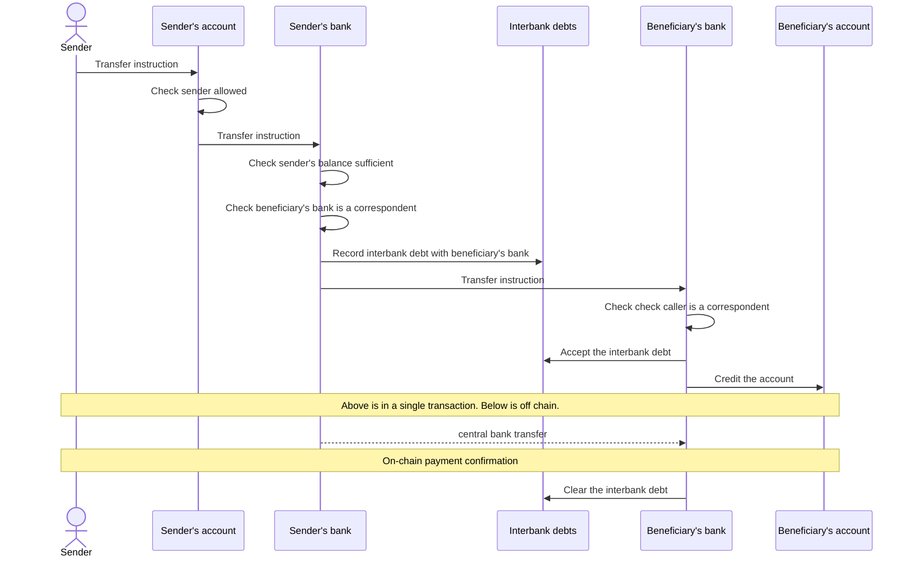

Preamble: The so|cash, sustainable & open cash framework, is open sourced under Apache 2.0 licence and provided as a guidance to ellaborate with other financial institutions an on-chain correspondent banking model. The framework is based on the experimentation and lessons learned on representing settlement assets in blockchain. This page is a living document and will be updated as the so|cash experience evolves. The framework is provided as is and without any warranty. The framework is not an advise for investment or any other financial decision. 

# Sustainable & Open Cash framework

## 1. Introduction and Background

With the development of asset tokenisation in blockchain, many have realised that the gain will come from the atomic settlement of an exchange of such tokenized asset against an asset that will be an acceptable representation of the value of such asset and making the exchange final such that there is no (or limited) risk that the exchange will be reversed.

Among the solutions that have been proposed and tested we can cite the use of stable coins, the use of central bank digital currencies (CBDC), the use of a central bank as a trusted third party to settle the exchange and side dedicated networks to settle the exchange (such as the Fnality project of the RLN project).

All these solutions have benefits and drawbacks. The use of stable coins is limited by the fact that the value of the stable coin, assuming properly managed, is guaranteed by a private structure, embedding in it a credit risk, and making it non fungible with other stable coins from another entity. Further more, the stable coin model assume that the issuer of such token will not use the collateral to invest in other assets, draining liquidity from the banks to play their role in financing the economy. 
The use of CBDC is limited by the fact that the CBDC is not available yet and that if and when available it is likely not going to be available to non financial institutions (for wholesale CBDC) or in limited quantity (retail CBDC). Further more, we do not anticipate that central banks will be happy to see the country money being issued in an infrastructure that they do not fully control (hence if issued, it will be in a dedicated network). Therefore this will create the need for bridges between the networks where tokenised assets circulate and the CBDC network and removing the benefit of an atomic settlement.
Similarly, network of settlement such as Fnality or RLN will require the creation of bridges between the network and the asset networks, removing the benefit of an atomic settlement and draining liquidity from the commercial banks.


The `so|cash` framework is an alternative proposal that is believed to address the above issues by using a network of commercial banks to settle the exchange of tokenised assets. The framework is based on the following principles:
- the blockchain network is to be seen as an agnostic IT infrastructure,
- cash on-chain is not removing liquidity from the commercial banks,
- no central actor should be in control of the settlement network,
- the settlement network should be open to any financial institution,
- the existing regulatory and legal framework for correspondent banking should be used

`so|cash` is a brand name for solutions that have been presented as tokenised deposits, on-chain cash accounts, tokenized correspondent banking or similar appelations.

## 2. The existing correspondent banking model

In today's world, a (physical or moral) person holds a cash account with a commercial bank in a certain fiat currency to host the money it owns in this currency. Of course it can have several bank account in several banks and in several currencies.

Commercial banks will record in their balance sheet (i.e. in their accounting books) a liability to that person that says that the banks owes such amount of money to that person. This money is either received by the bank from another bank on behalf of that person or it was created by the bank itself as a loan to the person. In both cases, the bank will record an asset in its books with the received money (held by the bank in another bank, generally a central bank) or with the loan granted.

Commercial banks will consider the deposited cash as its own and take actions to make that money useful to the economy by lending it or investing it. The duties of the banks is to ensure that the money is available to the person when needed and to do this the bank perform an ALM (Assets and Liabilities Management) to ensure that the bank has enough liquidity at any point in time to meet its obligations and that regulatory ratios are respected (liquidity and risk ratios defined - in compliant member states - by the Basel Committee on Banking Supervision (BCBS)).

The money that the person has in its account is a legal fiat money, acceptable for any payment, because the account that holds it is with an instititution regulated and supervised. 

When the person holding the account (the sender) wishes to transfer its own money to the account of another person (the beneficiary of the transfer) it provides such transfer instruction to its bank (typically a Swift MT101). Several scenarios are possible:
- the beneficiary's account is in the same bank : the bank will simply modify the ownership of the money in its books by debitting the sender's account and crediting the beneficiary's account.
- the beneficiary's account is not in the same bank (bank B), and the sender's bank has a correspondent relationship with bank B : the sender's bank will send a payment instruction to bank B (typically a Swift MT103) to instruct bank B to credit the beneficiary's account. The sender's bank will debit the sender's account and will perform an interbank payment, generally in central bank systems. Bank B, upon reception of the payment, will credit the beneficiary's account in its books.
- the beneficiary's account is with a bank (bank C) that is not a correspondent of the sender's bank: the sender's bank should identify a correspondent bank (bank D) that has a correspondent relationship with bank C and instruct bank D to act as intermediary of the payment and relay the money.
- the beneficiary's account is in a different currency: a currency exchange will be needed and multiple scenarios can arise depending on who performs the purchase of the original currency and the sale of the target currency. 

When the person holding the account accepts that a third party takes money out of its account it must first inform its bank that there is a form of delegation to instruct the bank to perform transfer on its behalf. Then the third party can perform such operation. This is the case for direct debits where the beneficiary has the right to initiate the transfer. There are other cases where intermediaries can initiate the transfer on behalf of the sender, such as the case of a merchant that accepts payment by card and the card company instructs the sender's bank to initiate the transfer (if not a credit card). In these cases, the transfer instruction can be processed in the same way as above following different scenarios.

One particular element to understand is that interbanks transfers (when both banks have an account with the clearing system in central bank money) is done with the money they held at the central bank (ie the central bank having a liability to them). When they have to make such transfer but they do not have the necessary amount in their central bank account, the bank will call the market (ie other banks) to borrow the money. This is the Treasury service of a bank.

## 3. The `so|cash` framework 

The `so|cash` framework uses the blockchain as an IT infrastructure to replicate the correspondent banking model.

Each bank participating will host a back office module in the form of a smart contract. It manages the volume of cash that are the liabilities to its customers.   
Each account holder will be granted an account represented on-chain and created by the bank in the form of a dedicated smart contract linked to the back office module. This account will represent the interface for the account holder to see its balance, initiate transfers or delegate its rights to make transfer.

When a transfer is initiated by a customer to a beneficiary, the instruction is transfered to the back office module where the different transfer rules will be implemented. If the beneficiary account is managed in the same back office module, then it can be implemented like a stable coin logic (simple transfer). However if the transfer involves a beneficiary that is in another bank, the on-chain back office module should be in capacity to reach the smart contract of the beneficiary's bank via a smart contract call.

Therefore some convention need to be agreed between the banks to enable the back office modules to communicate in a similar way as the existing swift messages today reflect the conventions used. 

### 3.1. Interbank convention to a standard API

First let's consider the simple flow diagram below illustrating a transfer initiated by an account holder to a beneficiary in a different bank where the two banks have a correspondent relationship.



In this diagram we see that for the beneficiary's bank to accept the transfer and credit its client (the beneficiary) it has to receive from the sender's bank a confirmation that it will pay its due in central bank money. For this, before the smart contract of the sender's bank instruct the beneficiary's bank, it has to commit to the interbank payment by allowing the beneficiary's bank to record a debt to itself.

This is the role of the Interbank debt smart contract, also called "IOU" as a short for "I owe you". This smart contract represents the debts in central bank money that banks have with other banks.

Repayment of such debt can be done in many ways depending on the agreements between the banks. They can both agree to be paid on the net due at the end of day by conventional means, or to be paid immediatly by a central bank transfer, or to be paid by a central bank transfer when the debt reaches a certain amount (etc). The action of repaying the debt can be initiated by a third party who would be entitled by the sender's bank to debit its account at the central bank and entitled by the receiving bank to clear the debt.

When paid, the receiving bank should confirm the payment to the IOU smart contract to clear (or reduce) the debt.

The following gives in solidity the interface of the IOU smart contract and the back office modules to enable interbank transfers.

```javascript
// follows ERC20 interface convention
interface IIOU {
  // called by the sender's bank bo module to allow the receiving bank 
  // to initiate the transferFrom, meaning create the debt
  function approve(address delegate, uint256 amount) external returns (bool);
  // called by the receiving bank bo module to create the debt with the sender
  function transferFrom(address sender, address recipient, uint256 amount) external returns (bool);
  // called by the receiving bank or an allowed 3rd party to confirm the payment 
  // and clear/reduce the debt
  function receiveConfirm(address from, uint256 amount) external returns (bool);
}
```
The following gives in solidity the interface of the back office module to enable interbank transfers.

```javascript
interface IInterBankBackOffice {
  // called by the BO module of the sender's bank to inform the receiving bank 
  // of the transfer and that the it commits to a debt
  function interbankTransfer(address recipient, uint256 amount) external returns (bool);
}
```

### 3.2 User to bank convention to a standard API

Users of a bank account managed on-chain will need to interact with the bank back office module to initiate transfers. This should be done through an intermediary smart contract dedicated to the user and integrating the specific controls that the bank want to implement for the customer. This intermediary smart contract will be the interface between the user and the bank back office module.

In order to make the bank account as much as possible compatible with the industry standard the interface shall respect the ERC20 interface convention. This will also enable the user to use any wallet that is ERC20 compatible to interact with its account.

The following gives in solidity the interface of the user bank account.

```javascript
interface IBankAccount {
  // the name can reflect the IBAN of the account or another reference
  function name() external view returns (string memory);
  // the ISO currency code of the account
  function symbol() external view returns (string memory);
  // the number of decimals used to represent the smallest unit of the currency
  function decimals() external view returns (uint8);

  // synonymous to the balanceOf function of ERC20, but without the need to specify the owner 
  // as the owner is the bank account
  function balance() external returns(uint256);
  // ERC20 balanceOf function
  function balanceOf(address account) external view returns (uint256);
  // initiate a transfer from that account to the recipient being the beneficiary's bank account
  // the msg.sender should be an allowed address the list of which can be managed by the bank
  function transfer(address recipient, uint256 amount) external returns (bool);
  // allow an external msg.sender to initiate a transfer from that account to the recipient
  function approve(address spender, uint256 amount) external returns (bool);
  // synonymous to the allowance function of ERC20 to get the amount that the spender is allowed 
  // to transfer on behalf of the account owner
  function allowance(address owner, address spender) external view returns (uint256);
  // to be called by an an allowed msg.sender to initiate a transfer on the account owner's behalf
  function transferFrom(address sender, address recipient, uint256 amount) external returns (bool);
}

```

<!--

**Here are some ideas to get you started:**

🙋‍♀️ A short introduction - what is your organization all about?
🌈 Contribution guidelines - how can the community get involved?
👩‍💻 Useful resources - where can the community find your docs? Is there anything else the community should know?
🍿 Fun facts - what does your team eat for breakfast?
🧙 Remember, you can do mighty things with the power of [Markdown](https://docs.github.com/github/writing-on-github/getting-started-with-writing-and-formatting-on-github/basic-writing-and-formatting-syntax)
-->
